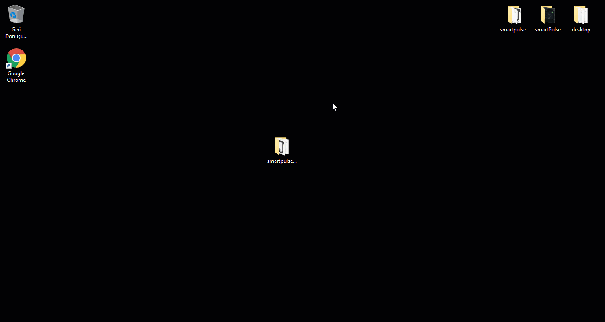
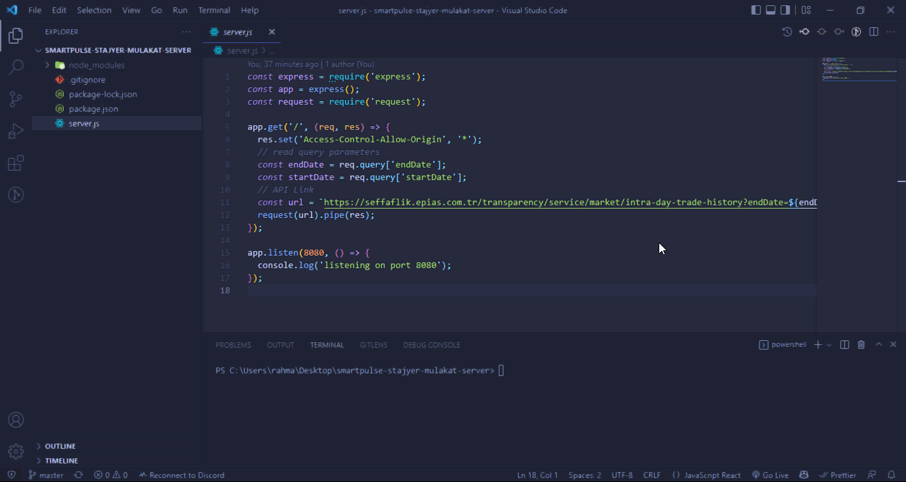
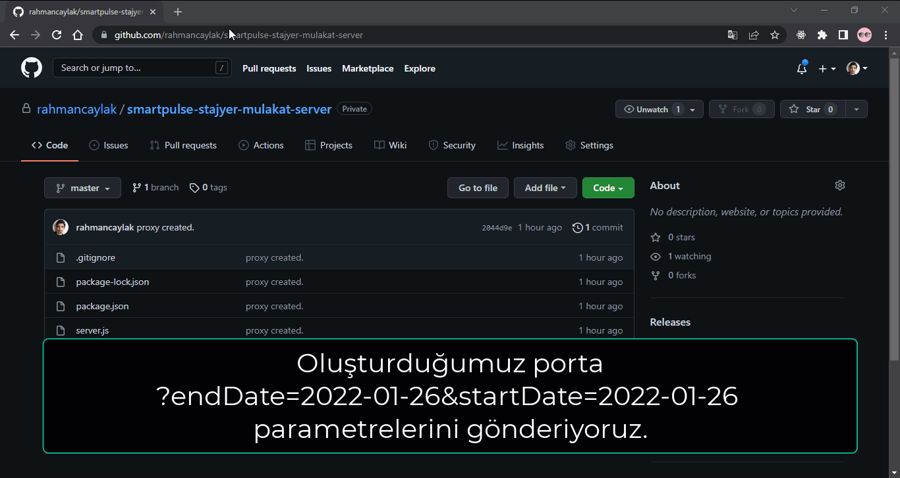
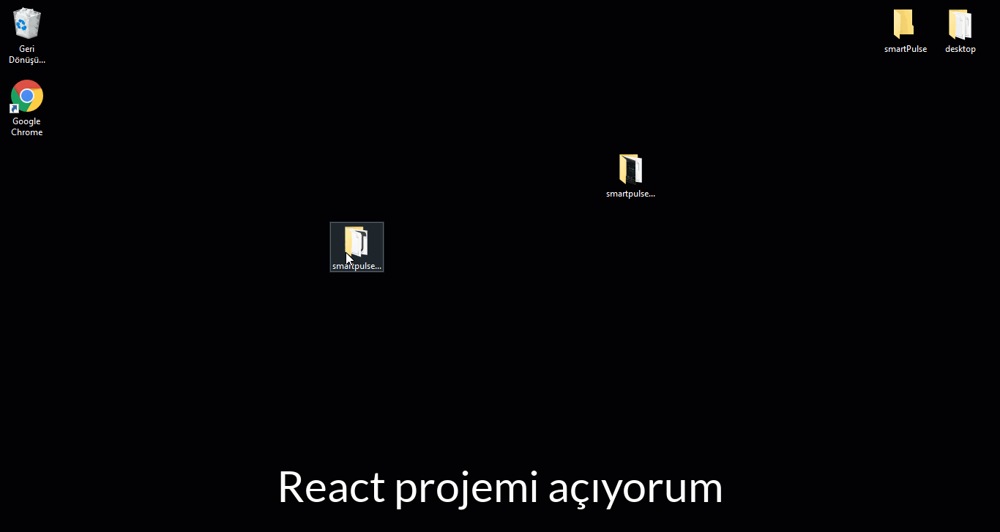

# smartPulse Teknik Mülakat Server Kurulumu

## 1. Adım

Bu adımda github reposundan server'ı bilgisayarımıza kuruyoruz.

Git Komutu:

`git clone https://github.com/rahmancaylak/smartpulse-stajyer-mulakat-server.git`

## 2. Adım

Bu adımda ise gerekli npm paketlerini kuruyoruz. Görselde örnek olarak VSCode kullanıldı.

`npm i` veya `npm install`

## 3. Adım

Sunucunun gerçekten çalışıp, çalışmadığını test ediyoruz.

`npm start` ile başlattıktan sonra `http://localhost:8080/` adresini açıyoruz.

## 4. Adım

Artık api adresi olarak kendi sunucumuzu kullanacağız.

`http://localhost:8080/` adresimize endDate ve startDate parametreleri gönderiyoruz.

Örnek parametre: `http://localhost:8080/?endDate=2022-04-01&startDate=2022-04-01`

## 5. Adım (React İçin Yapılması Gereken)

React projemizi açıp, package.json içerisine `"proxy": "http://localhost:8080/",` ekliyoruz.

